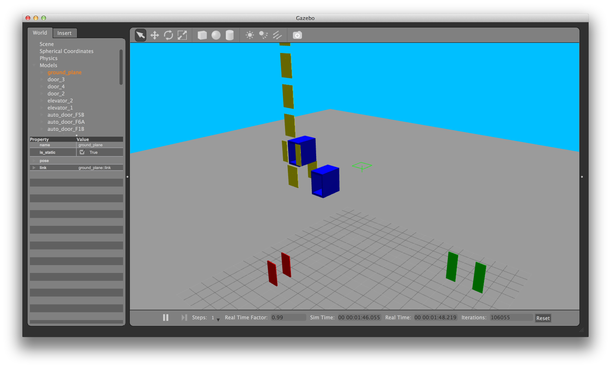

Dynamic Gazebo Models
==============

Gazebo models for simulating doors/elevators. Currently available models: flip-open doors, slide-open doors, elevators with automatic slide-open doors (more coming soon). Plus, the bundle also comes with a generic dynamics-manager to control model groups through ROS service-calls or keyboard-op.

## Dependencies & Prerequisites
[ROS Hydro](http://wiki.ros.org/hydro), [Gazebo 3.0+](http://gazebosim.org/), 
[Catkin](http://wiki.ros.org/catkin): see [package.xml](package.xml)

## Installation
Clone Repo:
```bash
$ cd <catkin_ws>/src
$ git clone https://github.com/MohitShridhar/dynamic_gazebo_models.git
```
Resolve dependencies (in Ubuntu) & Compile:
```bash
$ cd <catkin_ws>
$ rosdep install --from-paths src --ignore-src --rosdistro hydro -y
$ catkin_make --pkg dynamic_gazebo_models
```
Launch sample:
```bash
$ roslaunch dynamic_gazebo_models dynamic_models_test.launch
```
There are a lot of models to spawn, so be patient. You should see a bunch of doors and elevators:


## Control

### Manual
```bash
$ rosrun dynamic_gazebo_models keyboard_op 
```
Follow the instructions to control a group of doors | elevators.

## Guide

See the [wiki](https://github.com/MohitShridhar/dynamic_gazebo_models/wiki/User-Guide) for more details.

## More Examples

[multi_map_navigation](https://github.com/MohitShridhar/multi_map_navigation), [oculus_gazebo_navigator](https://github.com/MohitShridhar/oculus_gazebo_navigator)

